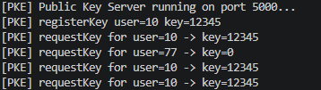
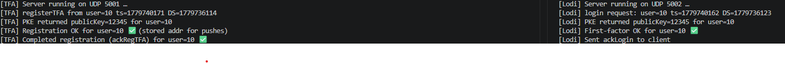
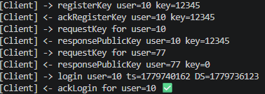

# UDP Authentication System in C

## Overview

This project is a C-based networking project that simulates a multi-server authentication system over UDP sockets. It includes a public-key exchange server, a login server, a two-factor authentication server, and client programs that communicate through structured C messages.

The project demonstrates low-level network programming, client-server communication, message serialization through structs, and a simplified authentication workflow.

## Features

- UDP socket communication in C
- Public-key registration and lookup server
- Login server with first-factor authentication
- Two-factor authentication registration flow
- Shared message definitions through a common header file
- Timestamp-based signature simulation
- Command-line testing workflow

## Project Components

| File            | Purpose                                                                    |
| --------------- | -------------------------------------------------------------------------- |
| `common.h`      | Shared constants, ports, enums, and message structs                        |
| `pke_server.c`  | Public Key Exchange server for registering and retrieving user public keys |
| `lodi_client.c` | Demo client that registers a key, requests a key, and attempts login       |
| `lodi_server.c` | Login server that verifies client login messages using the PKE server      |
| `tfa_client.c`  | Client that registers for two-factor authentication                        |
| `tfa_server.c`  | TFA server that verifies registration and stores client address data       |
| `test_sender.c` | Small UDP test sender used for basic server testing                        |

## Authentication Model

This project uses a simplified signature model for demonstration purposes:

```c
signature = timestamp ^ privateKey
```

The server verifies it using:

```c
signature ^ publicKey == timestamp
```

For the demo, the public key and private key are intentionally the same value so the XOR verification works. This is not real cryptography. It is an educational simulation of authentication flow and message verification.

## Requirements

- Linux, macOS, WSL, or another Unix-like environment
- GCC
- Make

## Build

```bash
make
```

To remove compiled binaries:

```bash
make clean
```

## Run: Login Flow

Open three terminals from the project folder.

Terminal 1:

```bash
./pke_server
```

Terminal 2:

```bash
./lodi_server
```

Terminal 3:

```bash
./lodi_client
```

Expected result: the client registers its public key with the PKE server, requests key data, sends a login request to the Lodi server, and receives an `ackLogin` response if verification succeeds.

## Run: TFA Registration Flow

Open three terminals from the project folder.

Terminal 1:

```bash
./pke_server
```

Terminal 2:

```bash
./tfa_server
```

Terminal 3:

```bash
./lodi_client
./tfa_client
```

The `lodi_client` registers the demo user's key with the PKE server. Then `tfa_client` sends a TFA registration request, which the TFA server verifies through the PKE server.


## Demo Screenshots

### Public Key Exchange Server


### Login Flow


### Two-Factor Authentication Flow



## Skills Demonstrated

- C programming
- UDP sockets
- Client-server architecture
- Network message design
- Struct-based protocol design
- Authentication workflow simulation
- Linux command-line development
- Makefile-based builds

## Future Improvements

- Replace the simplified XOR signature with real cryptographic signing
- Add timeout handling for UDP receive operations
- Add clearer error responses for failed authentication
- Integrate the login server with the TFA server for a complete two-factor login flow
- Add command-line arguments for user IDs, keys, and server addresses
- Add automated test scripts
